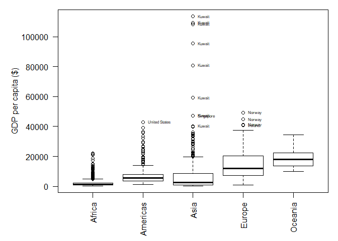
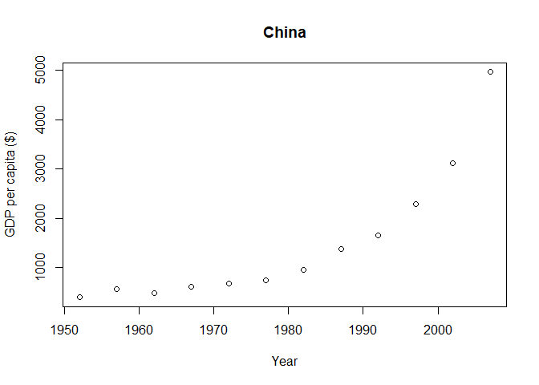
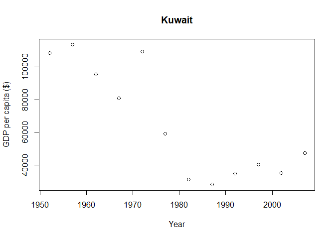
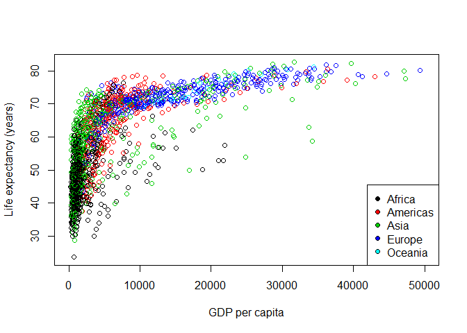

Assignment 1: gapminder exploration
================
Trevor Baker, 98610074
11/09/2019

This document explores the *gapminder* dataset of historical demographic
data spanning from 1952 to 2007 in five-year intervals.

The dataset includes the following
    fields:

    ## [1] "country"   "continent" "year"      "lifeExp"   "pop"       "gdpPercap"

Here is a brief summary of the integer and numeric
    columns:

    ##       year         lifeExp           pop              gdpPercap       
    ##  Min.   :1952   Min.   :23.60   Min.   :6.001e+04   Min.   :   241.2  
    ##  1st Qu.:1966   1st Qu.:48.20   1st Qu.:2.794e+06   1st Qu.:  1202.1  
    ##  Median :1980   Median :60.71   Median :7.024e+06   Median :  3531.8  
    ##  Mean   :1980   Mean   :59.47   Mean   :2.960e+07   Mean   :  7215.3  
    ##  3rd Qu.:1993   3rd Qu.:70.85   3rd Qu.:1.959e+07   3rd Qu.:  9325.5  
    ##  Max.   :2007   Max.   :82.60   Max.   :1.319e+09   Max.   :113523.1

While Europe is the richest continent on average, Kuwait, which is
included in the Asian continent, is the richest country overall. In the
graph below, all countries with average income values greater than
$40000 have been labelled. These include Kuwait, Norway, Singapore, and
the United States.

<!-- -->

Some countries have gotten more wealthy over time:

<!-- -->

Some countries have gotten less wealthy over time:

<!-- -->

There seems to be an asymptotic relationship between life expectancy and
GDP. Mean life expectancy doesn’t increase much beyond 80 years, no
matter how rich the country.
<!-- -->
