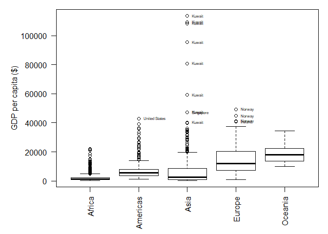
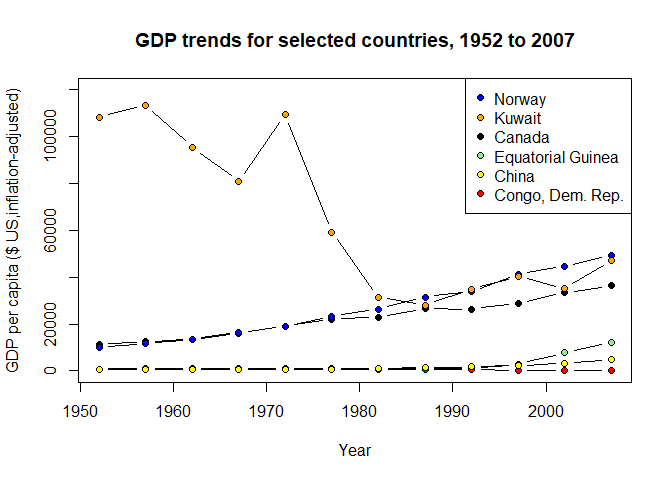
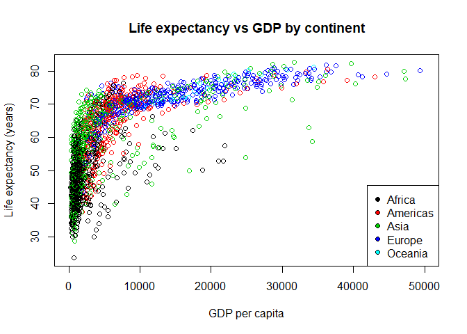

Assignment 1: gapminder exploration
================
Trevor Baker, 98610074
11/09/2019

This document explores the *gapminder* dataset of historical demographic
data spanning from 1952 to 2007 in five-year intervals.

## Basic dataset overview

The dataset includes the following
    fields/columns:

    ## [1] "country"   "continent" "year"      "lifeExp"   "pop"       "gdpPercap"

Here is a brief summary of the integer and numeric
    columns:

    ##       year         lifeExp           pop               gdpPercap       
    ##  Min.   :1952   Min.   :23.60   Min.   :     60011   Min.   :   241.2  
    ##  1st Qu.:1966   1st Qu.:48.20   1st Qu.:   2793664   1st Qu.:  1202.1  
    ##  Median :1980   Median :60.71   Median :   7023596   Median :  3531.8  
    ##  Mean   :1980   Mean   :59.47   Mean   :  29601212   Mean   :  7215.3  
    ##  3rd Qu.:1993   3rd Qu.:70.85   3rd Qu.:  19585222   3rd Qu.:  9325.5  
    ##  Max.   :2007   Max.   :82.60   Max.   :1318683096   Max.   :113523.1

## GDP trends

While Oceania is the richest continent on average, Kuwait, which is on
the Asian continent, is the richest country overall. In the graph below,
all countries with average income values greater than $50000 have been
labelled. These include Kuwait, Norway, Singapore, and the United
States.  
<!-- -->

A look at some GDP trends by country over time:  
<!-- -->

You can see general groupings of GDP and life expectancy by continent in
the graph below. Also, there seems to be an asymptotic relationship
between life expectancy and GDP. Mean life expectancy doesn’t increase
much beyond 80 years, no matter how rich the country.  
<!-- -->
