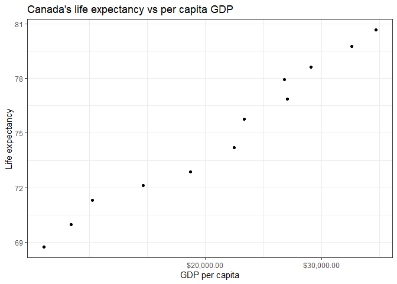
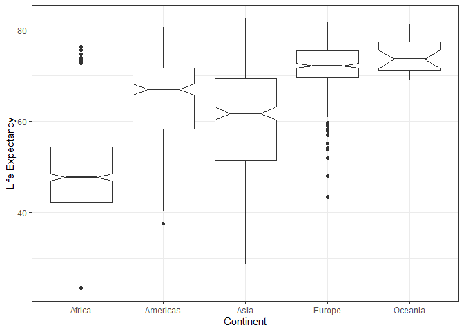
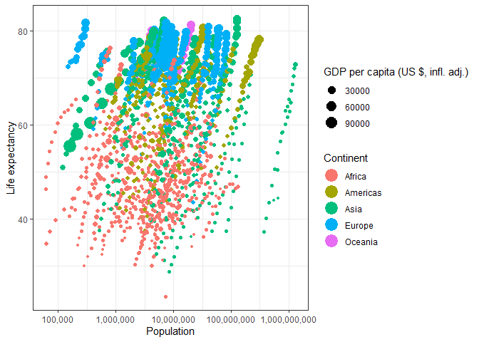
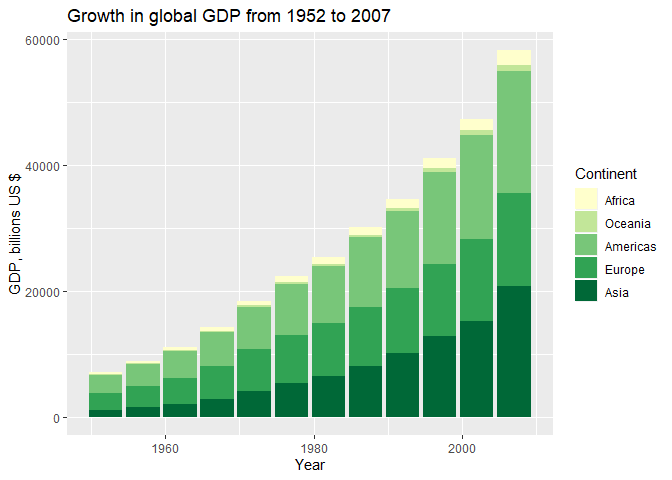

## EXERCISE 1
#### Basic 'dplyr'

__1.1__

```r
knitr::kable(
  gapminder %>%
    filter(year>=1970 & year<1980 & (country=="China" | country=="Canada" | country=="United States"))
)
```


country         continent    year    lifeExp         pop    gdpPercap
--------------  ----------  -----  ---------  ----------  -----------
Canada          Americas     1972   72.88000    22284500   18970.5709
Canada          Americas     1977   74.21000    23796400   22090.8831
China           Asia         1972   63.11888   862030000     676.9001
China           Asia         1977   63.96736   943455000     741.2375
United States   Americas     1972   71.34000   209896000   21806.0359
United States   Americas     1977   73.38000   220239000   24072.6321


__1.2__

```r
gapminder %>%
  filter(year>=1970 & year<1980 & (country=="China" | country=="Canada" | country=="United States")) %>%
  select(country, gdpPercap)
```

```
## # A tibble: 6 x 2
##   country       gdpPercap
##   <fct>             <dbl>
## 1 Canada           18971.
## 2 Canada           22091.
## 3 China              677.
## 4 China              741.
## 5 United States    21806.
## 6 United States    24073.
```


__1.3__

```r
gapminder %>%
  group_by(country) %>%
  mutate(lifeExp.incr=lifeExp-lag(lifeExp) ) %>%
  filter(lifeExp.incr<0)
```

```
## # A tibble: 102 x 7
## # Groups:   country [52]
##    country  continent  year lifeExp     pop gdpPercap lifeExp.incr
##    <fct>    <fct>     <int>   <dbl>   <int>     <dbl>        <dbl>
##  1 Albania  Europe     1992    71.6 3326498     2497.       -0.419
##  2 Angola   Africa     1987    39.9 7874230     2430.       -0.036
##  3 Benin    Africa     2002    54.4 7026113     1373.       -0.371
##  4 Botswana Africa     1992    62.7 1342614     7954.       -0.877
##  5 Botswana Africa     1997    52.6 1536536     8647.      -10.2  
##  6 Botswana Africa     2002    46.6 1630347    11004.       -5.92 
##  7 Bulgaria Europe     1977    70.8 8797022     7612.       -0.09 
##  8 Bulgaria Europe     1992    71.2 8658506     6303.       -0.15 
##  9 Bulgaria Europe     1997    70.3 8066057     5970.       -0.87 
## 10 Burundi  Africa     1992    44.7 5809236      632.       -3.48 
## # ... with 92 more rows
```

__1.4__

```r
gapminder %>%
  group_by(country) %>%
  summarize(max.gdp=max(gdpPercap))
```

```
## # A tibble: 142 x 2
##    country     max.gdp
##    <fct>         <dbl>
##  1 Afghanistan    978.
##  2 Albania       5937.
##  3 Algeria       6223.
##  4 Angola        5523.
##  5 Argentina    12779.
##  6 Australia    34435.
##  7 Austria      36126.
##  8 Bahrain      29796.
##  9 Bangladesh    1391.
## 10 Belgium      33693.
## # ... with 132 more rows
```


__1.5__

```r
gapminder %>%
  filter(country=="Canada") %>%
  ggplot(aes(x=gdpPercap,y=lifeExp)) + 
            geom_point() +
            scale_x_log10("GDP per capita", labels = scales::dollar_format()) +
            ylab("Life expectancy") +
            ggtitle("Canada's life expectancy vs per capita GDP") +
            theme_bw()
```

<!-- -->

---

## EXERCISE 2
#### Explore individal variables with 'dplyr'

I have chosen life expectancy and continent to summarize here.

There are 5 continents in the dataset:

```r
#display all continents - kind of useles
gapminder %>%
  select(continent) %>%
  unique()
```

```
## # A tibble: 5 x 1
##   continent
##   <fct>    
## 1 Asia     
## 2 Europe   
## 3 Africa   
## 4 Americas 
## 5 Oceania
```


Here are some summary stats on global life expectancies:

```r
#display range of lifeExp data by continent
gapminder %>%
  select(lifeExp) %>%
  summarize(min.lifeExp=min(lifeExp)%>% round(digits=1),
            median.lifeExp=median(lifeExp)%>% round(digits=1),
            mean.lifeExp=mean(lifeExp)%>% round(digits=1),
            max.lifeExp=max(lifeExp) %>% round(digits=1)) 
```

```
## # A tibble: 1 x 4
##   min.lifeExp median.lifeExp mean.lifeExp max.lifeExp
##         <dbl>          <dbl>        <dbl>       <dbl>
## 1        23.6           60.7         59.5        82.6
```

It is more informative to see these summary statistics divided up by country:

```r
#display range of lifeExp data by continent
gapminder %>%
  select(continent, lifeExp) %>%
  group_by(continent) %>%
  summarize(min.lifeExp=min(lifeExp)%>% round(digits=1),
            median.lifeExp=median(lifeExp)%>% round(digits=1),
            mean.lifeExp=mean(lifeExp)%>% round(digits=1),
            max.lifeExp=max(lifeExp) %>% round(digits=1)) 
```

```
## # A tibble: 5 x 5
##   continent min.lifeExp median.lifeExp mean.lifeExp max.lifeExp
##   <fct>           <dbl>          <dbl>        <dbl>       <dbl>
## 1 Africa           23.6           47.8         48.9        76.4
## 2 Americas         37.6           67           64.7        80.7
## 3 Asia             28.8           61.8         60.1        82.6
## 4 Europe           43.6           72.2         71.9        81.8
## 5 Oceania          69.1           73.7         74.3        81.2
```

It's probably even more informative to see them graphed

```r
#display range of both variables via boxplot
gapminder %>%
  select(continent, lifeExp) %>%
  group_by(continent) %>%
  ggplot(aes(x=continent, y=lifeExp)) +
    geom_boxplot(notch=T) +
    ylab("Life Expectancy") +
    xlab("Continent") +
    theme_bw()
```

<!-- -->

---

## EXERCISE 3
#### Explore various plot types

__Plot 1__


```r
gapminder %>%
  ggplot(aes(x=pop, y=lifeExp, size=gdpPercap, fill=continent)) +
    geom_point(pch=21,colour="black") +
    scale_x_log10("Population", labels=scales::comma) +
    ylab("Life expectancy") +
    theme_bw() +
    scale_size_continuous(name="GDP per capita (US $, infl. adj.)", range=c(0.5,10)) +
    scale_fill_discrete(name="Continent") +
    guides(fill = guide_legend(override.aes = list(size=8)))
```

<!-- -->

__Plot 2__

```r
gapminder %>%
  mutate(gdp=gdpPercap*pop) %>%
  mutate(continent=factor(continent, #put small ones on top
                          levels=c("Africa","Oceania","Americas","Europe","Asia"))) %>%
  group_by(continent, year) %>%
  summarize(gdp.cont=sum(gdp)/1e9) %>%
  ggplot(aes(x=year, y=gdp.cont, fill=continent)) +
    geom_col() +
    scale_fill_brewer(palette="YlGn", 
                      name="Continent") +
    scale_y_continuous(name="GDP, billions US $") +
    scale_x_continuous(name="Year") +
    labs(title="Growth in global GDP from 1952 to 2007")
```

<!-- -->


