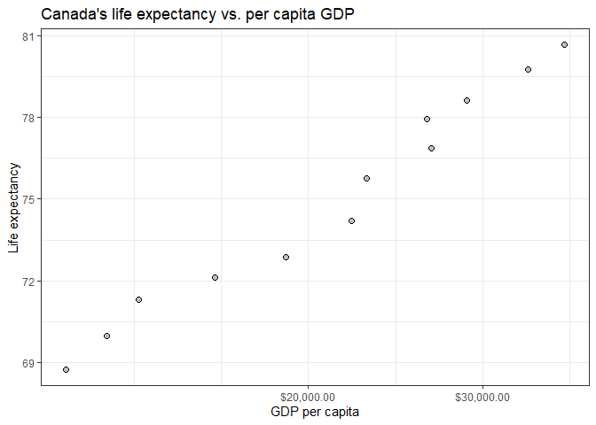
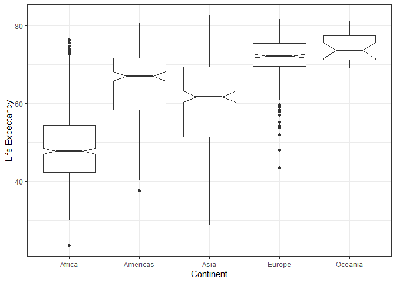
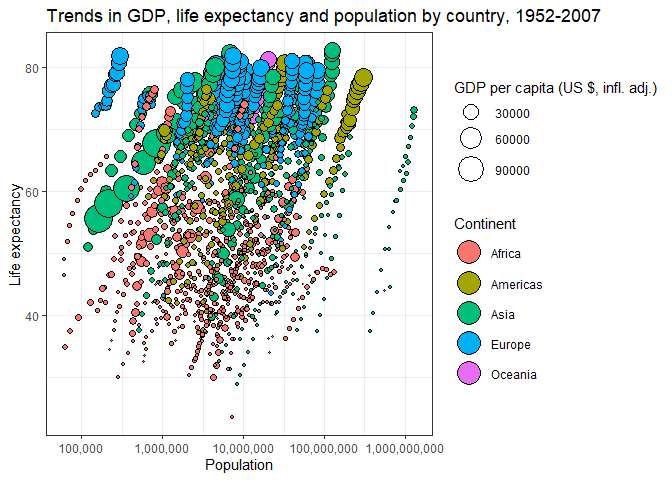
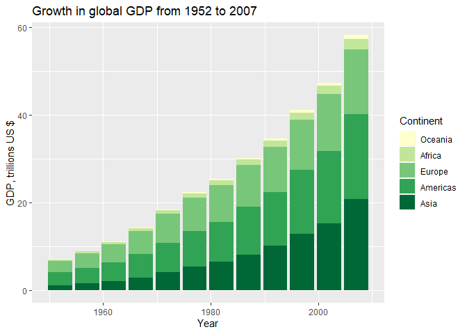

Assignment 2
================
Trevor Baker
19/09/2019

## EXERCISE 1

#### Basic ‘dplyr’

**1.1**

``` r
knitr::kable(
  gapminder %>%
    filter(between(year,1970,1980) & (country=="China" | country=="Canada" | country=="United States"))
)
```

| country       | continent | year |  lifeExp |       pop |  gdpPercap |
| :------------ | :-------- | ---: | -------: | --------: | ---------: |
| Canada        | Americas  | 1972 | 72.88000 |  22284500 | 18970.5709 |
| Canada        | Americas  | 1977 | 74.21000 |  23796400 | 22090.8831 |
| China         | Asia      | 1972 | 63.11888 | 862030000 |   676.9001 |
| China         | Asia      | 1977 | 63.96736 | 943455000 |   741.2375 |
| United States | Americas  | 1972 | 71.34000 | 209896000 | 21806.0359 |
| United States | Americas  | 1977 | 73.38000 | 220239000 | 24072.6321 |

**1.2**

``` r
knitr::kable(
  gapminder %>%
    filter(between(year,1970,1980) & (country=="China" | country=="Canada" | country=="United States")) %>%
    select(country, gdpPercap)
)
```

| country       |  gdpPercap |
| :------------ | ---------: |
| Canada        | 18970.5709 |
| Canada        | 22090.8831 |
| China         |   676.9001 |
| China         |   741.2375 |
| United States | 21806.0359 |
| United States | 24072.6321 |

**1.3**

``` r
DT::datatable(
  gapminder %>%
    group_by(country) %>%
    mutate(lifeExp.incr=round(lifeExp-lag(lifeExp),2) ) %>%
    filter(lifeExp.incr<0) %>%
    arrange(lifeExp.incr)
)
```

<!--html_preserve-->

<div id="htmlwidget-d414beff321f451a0d31" class="datatables html-widget" style="width:100%;height:auto;">

</div>

<script type="application/json" data-for="htmlwidget-d414beff321f451a0d31">{"x":{"filter":"none","data":[["1","2","3","4","5","6","7","8","9","10","11","12","13","14","15","16","17","18","19","20","21","22","23","24","25","26","27","28","29","30","31","32","33","34","35","36","37","38","39","40","41","42","43","44","45","46","47","48","49","50","51","52","53","54","55","56","57","58","59","60","61","62","63","64","65","66","67","68","69","70","71","72","73","74","75","76","77","78","79","80","81","82","83","84","85","86","87","88","89","90","91","92","93","94","95","96","97","98","99","100","101"],["Rwanda","Zimbabwe","Lesotho","Swaziland","Botswana","Cambodia","Namibia","South Africa","Zimbabwe","China","Botswana","Zambia","Iraq","Liberia","Cambodia","Kenya","Somalia","Zambia","Swaziland","Uganda","Swaziland","Lesotho","Cote d'Ivoire","South Africa","Gabon","Burundi","Congo, Rep.","Kenya","Central African Republic","Namibia","Congo, Dem. Rep.","Central African Republic","Uganda","Cote d'Ivoire","Malawi","Cameroon","Mozambique","Korea, Dem. Rep.","Rwanda","Cameroon","Lesotho","Tanzania","Zimbabwe","Mozambique","Malawi","Congo, Dem. Rep.","Iraq","Sierra Leone","South Africa","El Salvador","Montenegro","Cote d'Ivoire","Central African Republic","Tanzania","Korea, Dem. Rep.","Chad","Zambia","Congo, Rep.","Zambia","Gabon","Botswana","Bulgaria","Nigeria","Togo","Puerto Rico","Cameroon","Korea, Dem. Rep.","Uganda","Iraq","Eritrea","Slovak Republic","Hungary","Uganda","Trinidad and Tobago","Albania","Myanmar","Hungary","Trinidad and Tobago","Benin","Congo, Dem. Rep.","Poland","Jamaica","Croatia","Poland","Romania","Bulgaria","Chad","Serbia","Romania","Ghana","Bulgaria","Czech Republic","El Salvador","Norway","Netherlands","Denmark","Kenya","Angola","Gabon","Congo, Dem. Rep.","Nigeria"],["Africa","Africa","Africa","Africa","Africa","Asia","Africa","Africa","Africa","Asia","Africa","Africa","Asia","Africa","Asia","Africa","Africa","Africa","Africa","Africa","Africa","Africa","Africa","Africa","Africa","Africa","Africa","Africa","Africa","Africa","Africa","Africa","Africa","Africa","Africa","Africa","Africa","Asia","Africa","Africa","Africa","Africa","Africa","Africa","Africa","Africa","Asia","Africa","Africa","Americas","Europe","Africa","Africa","Africa","Asia","Africa","Africa","Africa","Africa","Africa","Africa","Europe","Africa","Africa","Americas","Africa","Asia","Africa","Asia","Africa","Europe","Europe","Africa","Americas","Europe","Asia","Europe","Americas","Africa","Africa","Europe","Americas","Europe","Europe","Europe","Europe","Africa","Europe","Europe","Africa","Europe","Europe","Americas","Europe","Europe","Europe","Africa","Africa","Africa","Africa","Africa"],[1992,1997,2002,2002,1997,1977,2002,2002,2002,1962,2002,1997,1992,1992,1972,1997,1992,1992,2007,1997,1997,1997,1997,2007,2002,1992,1997,2002,1997,1997,1997,2002,1992,1992,2002,2002,2002,1997,1987,1997,2007,1997,1992,2007,1997,1992,2002,1992,1997,1977,2002,2002,1992,1992,2002,2002,2002,1992,1987,1997,1992,1997,2002,2002,1992,1992,1992,1977,1997,1982,1972,1982,1982,2002,1992,2002,1992,1997,2002,1987,1987,2002,1982,1977,1992,1992,1997,1982,1987,2002,1977,1972,1982,1987,1972,1982,1992,1987,2007,1982,1997],[23.599,46.809,44.593,43.869,52.556,31.22,51.479,53.365,39.989,44.50136,46.634,40.238,59.461,40.802,40.317,54.407,39.658,46.1,39.613,44.578,54.289,55.558,47.991,49.339,56.761,44.736,52.962,50.992,46.066,58.909,42.587,43.308,48.825,52.044,45.009,49.856,44.026,67.727,44.02,52.199,42.592,48.466,60.377,42.082,47.495,45.548,57.046,38.333,60.236,56.696,73.981,46.832,49.396,50.44,66.662,50.525,39.193,56.433,50.821,60.461,62.745,70.32,46.608,57.561,73.911,54.314,69.978,50.35,58.811,43.89,70.35,69.39,49.849,68.976,71.581,59.908,69.17,69.465,54.406,47.412,70.98,72.047,70.46,70.67,69.36,71.19,51.573,70.162,69.53,58.453,70.81,70.29,56.604,75.89,73.75,74.63,59.285,39.906,56.735,47.784,47.464],[7290203,11404948,2046772,1130269,1536536,6978607,1972153,44433622,11926563,665770000,1630347,9417789,17861905,1912974,7450606,28263827,6099799,8381163,1133066,21210254,1054486,1982823,14625967,43997828,1299304,5809236,2800947,31386842,3696513,1774766,47798986,4048013,18252190,12772596,11824495,15929988,18473780,21585105,6349365,14195809,2012649,30686889,10704340,19951656,10419991,41672143,24001816,4260884,42835005,4282586,720230,16252726,3265124,26605473,22215365,8835739,10595811,2409073,7272406,1126189,1342614,8066057,119901274,4977378,3585176,12467171,20711375,11457758,20775703,2637297,4593433,10705535,12939400,1101832,3326498,45598081,10348684,1138101,7026113,35481645,37740710,2664659,4413368,34621254,22797027,8658506,7562011,9032824,22686371,20550751,8797022,9862158,4474873,4186147,13329874,5117810,25020539,7874230,1454867,30646495,106207839],[737.0685949,792.4499603,1275.184575,4128.116943,8647.142313,524.9721832,4072.324751,7710.946444,672.0386227,487.6740183,11003.60508,1071.353818,3745.640687,636.6229191,421.6240257,1360.485021,926.9602964,1210.884633,4513.480643,816.559081,3876.76846,1186.147994,1786.265407,9269.657808,12521.71392,631.6998778,3484.164376,1287.514732,740.5063317,3899.52426,312.188423,738.6906068,644.1707969,1648.073791,665.4231186,1934.011449,633.6179466,1690.756814,847.991217,1694.337469,1569.331442,789.1862231,693.4207856,823.6856205,692.2758103,457.7191807,4390.717312,1068.696278,7479.188244,5138.922374,6557.194282,1648.800823,747.9055252,825.682454,1646.758151,1156.18186,1071.613938,4016.239529,1213.315116,14722.84188,7954.111645,5970.38876,1615.286395,886.2205765,14641.58711,1793.163278,3726.063507,843.7331372,3076.239795,524.8758493,9674.167626,12545.99066,682.2662268,11460.60023,2497.437901,611,10535.62855,8792.573126,1372.877931,672.774812,9082.351172,6994.774861,13221.82184,9508.141454,6598.409903,6302.623438,1004.961353,15181.0927,9696.273295,1111.984578,7612.240438,13108.4536,4098.344175,31540.9748,18794.74567,21688.04048,1341.921721,2430.208311,13206.48452,673.7478181,1624.941275],[-20.42,-13.57,-10.96,-10.42,-10.19,-9.1,-7.43,-6.87,-6.82,-6.05,-5.92,-5.86,-5.58,-5.23,-5.1,-4.88,-4.84,-4.72,-4.26,-4.25,-4.18,-4.13,-4.05,-4.03,-3.7,-3.48,-3.47,-3.41,-3.33,-3.09,-2.96,-2.76,-2.68,-2.61,-2.49,-2.34,-2.32,-2.25,-2.2,-2.12,-2,-1.97,-1.97,-1.94,-1.93,-1.86,-1.77,-1.67,-1.65,-1.51,-1.46,-1.16,-1.09,-1.09,-1.06,-1.05,-1.05,-1.04,-1,-0.91,-0.88,-0.87,-0.86,-0.83,-0.72,-0.67,-0.67,-0.67,-0.65,-0.64,-0.63,-0.56,-0.5,-0.49,-0.42,-0.42,-0.41,-0.4,-0.37,-0.37,-0.34,-0.22,-0.18,-0.18,-0.17,-0.15,-0.15,-0.14,-0.13,-0.1,-0.09,-0.09,-0.09,-0.08,-0.07,-0.06,-0.05,-0.04,-0.03,-0.02,-0.01]],"container":"<table class=\"display\">\n  <thead>\n    <tr>\n      <th> <\/th>\n      <th>country<\/th>\n      <th>continent<\/th>\n      <th>year<\/th>\n      <th>lifeExp<\/th>\n      <th>pop<\/th>\n      <th>gdpPercap<\/th>\n      <th>lifeExp.incr<\/th>\n    <\/tr>\n  <\/thead>\n<\/table>","options":{"columnDefs":[{"className":"dt-right","targets":[3,4,5,6,7]},{"orderable":false,"targets":0}],"order":[],"autoWidth":false,"orderClasses":false}},"evals":[],"jsHooks":[]}</script>

<!--/html_preserve-->

**1.4**

``` r
DT::datatable(
  gapminder %>%
    group_by(country) %>%
    summarize(max.gdp=max(gdpPercap) %>% round(digits=0)) %>%
    arrange(desc(max.gdp))
)
```

<!--html_preserve-->

<div id="htmlwidget-d9fc6bd4f29a2f33c673" class="datatables html-widget" style="width:100%;height:auto;">

</div>

<script type="application/json" data-for="htmlwidget-d9fc6bd4f29a2f33c673">{"x":{"filter":"none","data":[["1","2","3","4","5","6","7","8","9","10","11","12","13","14","15","16","17","18","19","20","21","22","23","24","25","26","27","28","29","30","31","32","33","34","35","36","37","38","39","40","41","42","43","44","45","46","47","48","49","50","51","52","53","54","55","56","57","58","59","60","61","62","63","64","65","66","67","68","69","70","71","72","73","74","75","76","77","78","79","80","81","82","83","84","85","86","87","88","89","90","91","92","93","94","95","96","97","98","99","100","101","102","103","104","105","106","107","108","109","110","111","112","113","114","115","116","117","118","119","120","121","122","123","124","125","126","127","128","129","130","131","132","133","134","135","136","137","138","139","140","141","142"],["Kuwait","Norway","Singapore","United States","Ireland","Hong Kong, China","Switzerland","Netherlands","Canada","Iceland","Austria","Denmark","Australia","Saudi Arabia","Sweden","Belgium","Finland","United Kingdom","Germany","Japan","France","Bahrain","Spain","Taiwan","Italy","Greece","Slovenia","Israel","New Zealand","Korea, Rep.","Czech Republic","Oman","Libya","Gabon","Portugal","Puerto Rico","Slovak Republic","Hungary","Trinidad and Tobago","Serbia","Poland","Iraq","Croatia","Chile","Venezuela","Argentina","Botswana","Malaysia","Equatorial Guinea","Mexico","Iran","Montenegro","Mauritius","Romania","Bulgaria","Uruguay","Lebanon","Panama","Costa Rica","South Africa","Brazil","Cuba","Turkey","Reunion","Thailand","Bosnia and Herzegovina","Jamaica","Ecuador","Peru","West Bank and Gaza","Tunisia","Colombia","Algeria","Dominican Republic","Albania","El Salvador","Egypt","Angola","Nicaragua","Guatemala","China","Congo, Rep.","Namibia","Jordan","Swaziland","Paraguay","Syria","Korea, Dem. Rep.","Sri Lanka","Bolivia","Morocco","Djibouti","Honduras","Indonesia","Philippines","Mongolia","Pakistan","Cameroon","Cote d'Ivoire","Sudan","India","Vietnam","Yemen, Rep.","Nigeria","Haiti","Comoros","Sao Tome and Principe","Mauritania","Zambia","Madagascar","Cambodia","Senegal","Chad","Togo","Lesotho","Sierra Leone","Kenya","Somalia","Benin","Bangladesh","Ghana","Burkina Faso","Central African Republic","Tanzania","Nepal","Uganda","Niger","Mali","Afghanistan","Guinea","Myanmar","Eritrea","Congo, Dem. Rep.","Gambia","Rwanda","Guinea-Bissau","Mozambique","Liberia","Zimbabwe","Malawi","Ethiopia","Burundi"],[113523,49357,47143,42952,40676,39725,37506,36798,36319,36181,36126,35278,34435,34168,33860,33693,33207,33203,32170,31656,30470,29796,28821,28718,28570,27538,25768,25523,25185,23348,22833,22316,21951,21746,20510,19329,18678,18009,18009,15871,15390,14688,14619,13172,13144,12779,12570,12452,12154,11978,11889,11733,10957,10808,10681,10611,10461,9809,9645,9270,9066,8948,8458,7670,7458,7446,7434,7429,7409,7111,7093,7007,6223,6025,5937,5728,5581,5523,5486,5186,4959,4880,4811,4519,4513,4259,4185,4107,3970,3822,3820,3694,3548,3541,3190,3096,2606,2603,2603,2602,2452,2442,2281,2014,2011,1938,1890,1803,1777,1749,1714,1712,1704,1650,1569,1465,1463,1451,1441,1391,1328,1217,1193,1107,1091,1056,1054,1043,978,946,944,913,906,885,882,838,824,803,799,759,691,632]],"container":"<table class=\"display\">\n  <thead>\n    <tr>\n      <th> <\/th>\n      <th>country<\/th>\n      <th>max.gdp<\/th>\n    <\/tr>\n  <\/thead>\n<\/table>","options":{"columnDefs":[{"className":"dt-right","targets":2},{"orderable":false,"targets":0}],"order":[],"autoWidth":false,"orderClasses":false}},"evals":[],"jsHooks":[]}</script>

<!--/html_preserve-->

**1.5**

``` r
gapminder %>%
  filter(country=="Canada") %>%
  ggplot(aes(x=gdpPercap,y=lifeExp)) + 
            geom_point(pch=21,cex=2, bg="grey") +
            scale_x_log10("GDP per capita", labels = scales::dollar_format()) +
            ylab("Life expectancy") +
            ggtitle("Canada's life expectancy vs. per capita GDP") +
            theme_bw()
```

<!-- -->

-----

## EXERCISE 2

#### Explore individual variables with ‘dplyr’

I have chosen life expectancy and continent to summarize here.

There are 5 continents in the dataset:

``` r
#display all continents - kind of useless
knitr::kable(
  gapminder %>%
    select(continent) %>%
    unique()
)
```

| continent |
| :-------- |
| Asia      |
| Europe    |
| Africa    |
| Americas  |
| Oceania   |

Here are some summary stats on global life expectancies:

``` r
#display range of lifeExp data globally:

# #method 1
# knitr::kable(
#   gapminder %>%
#     select(lifeExp) %>%
#     summarize(min.lifeExp=min(lifeExp)%>% round(digits=1),
#               Q1.lifeExp=quantile(lifeExp, 0.25) %>% round(digits=1),
#               median.lifeExp=median(lifeExp)%>% round(digits=1),
#               mean.lifeExp=mean(lifeExp)%>% round(digits=1),
#               Q3.lifeExp=quantile(lifeExp, 0.75) %>% round(digits=1),
#               max.lifeExp=max(lifeExp) %>% round(digits=1)) 
# )

#method 2
knitr::kable(
  gapminder %>%
    select(lifeExp) %>%
    summary()
)
```

|  |    lifeExp    |
|  | :-----------: |
|  |  Min. :23.60  |
|  | 1st Qu.:48.20 |
|  | Median :60.71 |
|  |  Mean :59.47  |
|  | 3rd Qu.:70.85 |
|  |  Max. :82.60  |

It is more informative to see these summary statistics divided up by
continent:

``` r
#display range of lifeExp data by continent

# #method 1
# knitr::kable(
#   gapminder %>%
#     select(continent, lifeExp) %>%
#     group_by(continent) %>%
#     summarize(min.lifeExp=min(lifeExp)%>% round(digits=1),
#               Q1.lifeExp=quantile(lifeExp, 0.25) %>% round(digits=1),
#               median.lifeExp=median(lifeExp)%>% round(digits=1),
#               mean.lifeExp=mean(lifeExp)%>% round(digits=1),
#               Q3.lifeExp=quantile(lifeExp, 0.75) %>% round(digits=1),
#               max.lifeExp=max(lifeExp) %>% round(digits=1)) 
# )

#method 2
knitr::kable(
  gapminder %>%
    select(continent, lifeExp) %>%
    group_by(continent) %>%
    summarize(summ=list(c(summary(lifeExp) %>% round(digits=1)))) %>%
    unnest_wider(summ) 
)
```

| continent | Min. | 1st Qu. | Median | Mean | 3rd Qu. | Max. |
| :-------- | ---: | ------: | -----: | ---: | ------: | ---: |
| Africa    | 23.6 |    42.4 |   47.8 | 48.9 |    54.4 | 76.4 |
| Americas  | 37.6 |    58.4 |   67.0 | 64.7 |    71.7 | 80.7 |
| Asia      | 28.8 |    51.4 |   61.8 | 60.1 |    69.5 | 82.6 |
| Europe    | 43.6 |    69.6 |   72.2 | 71.9 |    75.5 | 81.8 |
| Oceania   | 69.1 |    71.2 |   73.7 | 74.3 |    77.6 | 81.2 |

It’s probably even more informative to see life expectancies graphed:

``` r
#display range of both variables via boxplot
gapminder %>%
  select(continent, lifeExp) %>%
  group_by(continent) %>%
  ggplot(aes(x=continent, y=lifeExp)) +
    geom_boxplot(notch=T) +
    ylab("Life Expectancy") +
    xlab("Continent") +
    theme_bw()
```

<!-- -->

-----

## EXERCISE 3

#### Explore various plot types

**Plot 1**

``` r
gapminder %>%
  ggplot(aes(x=pop, y=lifeExp, size=gdpPercap, fill=continent)) +
    geom_point(pch=21,colour="black") +
    scale_x_log10("Population", labels=scales::comma) +
    ylab("Life expectancy") +
    theme_bw() +
    scale_size_continuous(name="GDP per capita (US $, infl. adj.)", range=c(0.5,10)) +
    scale_fill_discrete(name="Continent") +
    guides(fill = guide_legend(override.aes = list(size=8))) +
    labs(title="Trends in GDP, life expectancy and population by country, 1952-2007")
```

<!-- -->

**Plot 2**

``` r
gapminder %>%
  mutate(gdp=gdpPercap*pop) %>%
  mutate(continent=factor(continent, #put small ones on top
                          levels=c("Oceania","Africa","Europe","Americas","Asia"))) %>%
  group_by(continent, year) %>%
  summarize(gdp.cont=sum(gdp)/1e12) %>%
  ggplot(aes(x=year, y=gdp.cont, fill=continent)) +
    geom_col() +
    scale_fill_brewer(palette="YlGn", 
                      name="Continent") +
    scale_y_continuous(name="GDP, trillions US $") +
    scale_x_continuous(name="Year") +
    labs(title="Growth in global GDP from 1952 to 2007")
```

<!-- -->

**Evaluate extra code**

Original code:

``` r
filter(gapminder, country == c("Rwanda", "Afghanistan"))
```

    ## # A tibble: 12 x 6
    ##    country     continent  year lifeExp      pop gdpPercap
    ##    <fct>       <fct>     <int>   <dbl>    <int>     <dbl>
    ##  1 Afghanistan Asia       1957    30.3  9240934      821.
    ##  2 Afghanistan Asia       1967    34.0 11537966      836.
    ##  3 Afghanistan Asia       1977    38.4 14880372      786.
    ##  4 Afghanistan Asia       1987    40.8 13867957      852.
    ##  5 Afghanistan Asia       1997    41.8 22227415      635.
    ##  6 Afghanistan Asia       2007    43.8 31889923      975.
    ##  7 Rwanda      Africa     1952    40    2534927      493.
    ##  8 Rwanda      Africa     1962    43    3051242      597.
    ##  9 Rwanda      Africa     1972    44.6  3992121      591.
    ## 10 Rwanda      Africa     1982    46.2  5507565      882.
    ## 11 Rwanda      Africa     1992    23.6  7290203      737.
    ## 12 Rwanda      Africa     2002    43.4  7852401      786.

The analyst’s intent was to get all rows of data for Rwanda and
Afghanistan. They did not succeed because they provided a vector with
length of 2 to the filter function, which was run through sequentially
by R because R recycles vectors. The code’s output was to retrieve the
first result for Rwanda, the second result for Afghanistan, the third
result for Rwanda, and so on.

A better way to do this would be to use filter to select all rows where
the country is Rwanda or the country is Afghanistan:

``` r
DT::datatable(
  filter(gapminder, country == "Rwanda" | country=="Afghanistan")  
)
```

<!--html_preserve-->

<div id="htmlwidget-eda0b4a86b8f62d4af57" class="datatables html-widget" style="width:100%;height:auto;">

</div>

<script type="application/json" data-for="htmlwidget-eda0b4a86b8f62d4af57">{"x":{"filter":"none","data":[["1","2","3","4","5","6","7","8","9","10","11","12","13","14","15","16","17","18","19","20","21","22","23","24"],["Afghanistan","Afghanistan","Afghanistan","Afghanistan","Afghanistan","Afghanistan","Afghanistan","Afghanistan","Afghanistan","Afghanistan","Afghanistan","Afghanistan","Rwanda","Rwanda","Rwanda","Rwanda","Rwanda","Rwanda","Rwanda","Rwanda","Rwanda","Rwanda","Rwanda","Rwanda"],["Asia","Asia","Asia","Asia","Asia","Asia","Asia","Asia","Asia","Asia","Asia","Asia","Africa","Africa","Africa","Africa","Africa","Africa","Africa","Africa","Africa","Africa","Africa","Africa"],[1952,1957,1962,1967,1972,1977,1982,1987,1992,1997,2002,2007,1952,1957,1962,1967,1972,1977,1982,1987,1992,1997,2002,2007],[28.801,30.332,31.997,34.02,36.088,38.438,39.854,40.822,41.674,41.763,42.129,43.828,40,41.5,43,44.1,44.6,45,46.218,44.02,23.599,36.087,43.413,46.242],[8425333,9240934,10267083,11537966,13079460,14880372,12881816,13867957,16317921,22227415,25268405,31889923,2534927,2822082,3051242,3451079,3992121,4657072,5507565,6349365,7290203,7212583,7852401,8860588],[779.4453145,820.8530296,853.10071,836.1971382,739.9811058,786.11336,978.0114388,852.3959448,649.3413952,635.341351,726.7340548,974.5803384,493.3238752,540.2893983,597.4730727,510.9637142,590.5806638,670.0806011,881.5706467,847.991217,737.0685949,589.9445051,785.6537648,863.0884639]],"container":"<table class=\"display\">\n  <thead>\n    <tr>\n      <th> <\/th>\n      <th>country<\/th>\n      <th>continent<\/th>\n      <th>year<\/th>\n      <th>lifeExp<\/th>\n      <th>pop<\/th>\n      <th>gdpPercap<\/th>\n    <\/tr>\n  <\/thead>\n<\/table>","options":{"columnDefs":[{"className":"dt-right","targets":[3,4,5,6]},{"orderable":false,"targets":0}],"order":[],"autoWidth":false,"orderClasses":false}},"evals":[],"jsHooks":[]}</script>

<!--/html_preserve-->

The same code can be written using the pipe operator:

``` r
DT::datatable(
  gapminder %>%
    filter(country == "Rwanda" | country=="Afghanistan")  
)
```

<!--html_preserve-->

<div id="htmlwidget-542d07586f6b1394a36f" class="datatables html-widget" style="width:100%;height:auto;">

</div>

<script type="application/json" data-for="htmlwidget-542d07586f6b1394a36f">{"x":{"filter":"none","data":[["1","2","3","4","5","6","7","8","9","10","11","12","13","14","15","16","17","18","19","20","21","22","23","24"],["Afghanistan","Afghanistan","Afghanistan","Afghanistan","Afghanistan","Afghanistan","Afghanistan","Afghanistan","Afghanistan","Afghanistan","Afghanistan","Afghanistan","Rwanda","Rwanda","Rwanda","Rwanda","Rwanda","Rwanda","Rwanda","Rwanda","Rwanda","Rwanda","Rwanda","Rwanda"],["Asia","Asia","Asia","Asia","Asia","Asia","Asia","Asia","Asia","Asia","Asia","Asia","Africa","Africa","Africa","Africa","Africa","Africa","Africa","Africa","Africa","Africa","Africa","Africa"],[1952,1957,1962,1967,1972,1977,1982,1987,1992,1997,2002,2007,1952,1957,1962,1967,1972,1977,1982,1987,1992,1997,2002,2007],[28.801,30.332,31.997,34.02,36.088,38.438,39.854,40.822,41.674,41.763,42.129,43.828,40,41.5,43,44.1,44.6,45,46.218,44.02,23.599,36.087,43.413,46.242],[8425333,9240934,10267083,11537966,13079460,14880372,12881816,13867957,16317921,22227415,25268405,31889923,2534927,2822082,3051242,3451079,3992121,4657072,5507565,6349365,7290203,7212583,7852401,8860588],[779.4453145,820.8530296,853.10071,836.1971382,739.9811058,786.11336,978.0114388,852.3959448,649.3413952,635.341351,726.7340548,974.5803384,493.3238752,540.2893983,597.4730727,510.9637142,590.5806638,670.0806011,881.5706467,847.991217,737.0685949,589.9445051,785.6537648,863.0884639]],"container":"<table class=\"display\">\n  <thead>\n    <tr>\n      <th> <\/th>\n      <th>country<\/th>\n      <th>continent<\/th>\n      <th>year<\/th>\n      <th>lifeExp<\/th>\n      <th>pop<\/th>\n      <th>gdpPercap<\/th>\n    <\/tr>\n  <\/thead>\n<\/table>","options":{"columnDefs":[{"className":"dt-right","targets":[3,4,5,6]},{"orderable":false,"targets":0}],"order":[],"autoWidth":false,"orderClasses":false}},"evals":[],"jsHooks":[]}</script>

<!--/html_preserve-->
