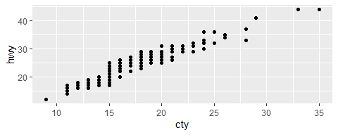
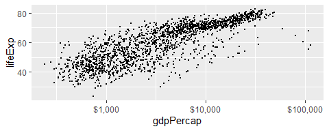
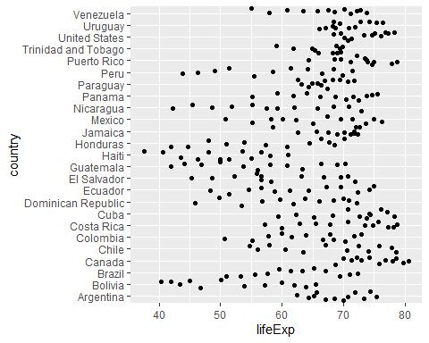
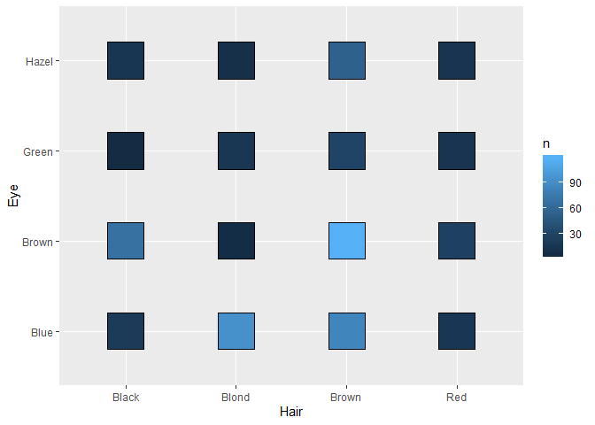

In this worksheet, we'll be looking at some erroneous plots and fixing them. 

I think you might not have these two packages installed:

```
install.packages("ggridges")
install.packages("scales")
```


<!---The following chunk allows errors when knitting--->


## Exercise 1: Overlapping Points

After fixing the error, fix the overlapping problem in the following plot (attribution: ["R for data science"](https://r4ds.had.co.nz/data-visualisation.html)).


```r
# ggplot(mpg, aes(cty, hwy)) %>% 
#   geom_point()

#+ not pipe
ggplot(mpg, aes(cty, hwy)) + 
  geom_point()
```

<!-- -->

```r
#use jitter and not so much overlap
ggplot(mpg, aes(cty, hwy)) + 
  geom_jitter()
```

<!-- -->

```r
#jittering is random, so each run has different offset

#or solve overlap by using alpha for transparency without jittering
ggplot(mpg, aes(cty, hwy)) + 
  geom_point(alpha=0.1)
```

<!-- -->

```r
#and adding linear regression
#even though this is jittered, the line we fit goes through original data not through the jittered point, 
#when run again jitter will be diff but lm line will stay the same
ggplot(mpg, aes(cty, hwy)) + 
  geom_jitter() + 
  geom_smooth(method="lm", colour="red") + #if we were not using method=lm it will fit a wavy line through data, something like moving average not a linear model
  theme_bw()
```

<!-- -->


## Exercise 2: Line for each Country

Fix this plot so that it shows life expectancy over time _for each country_. Notice that `ggplot2` ignores the grouping of a tibble!


```r
# gapminder %>% 
#   group_by(country) %>% 
#   ggplot(aes(year, lifeExp)) + #ggplot is ignoring the group_by above, so doesn't work
#   geom_line()

gapminder %>%
  #group_by(country) %>%
  ggplot(aes(year, lifeExp, group=country, colour=continent)) +
  geom_line(alpha=0.2) #add alpha so overlap is not so bad
```

<!-- -->

```r
#just highlight one country
gapminder %>%
  #group_by(country) %>%
  ggplot(aes(year, lifeExp, group=country, colour=country=="Rwanda")) +
  scale_colour_manual("", labels=c("Other","Rwanda"), values=c("grey","red")) +
  geom_line(alpha=0.4) #add alpha so overlap is not so bad
```

<!-- -->


## Exercise 3: More gdpPercap vs lifeExp

### 3(a) Facets

- Change the x-axis text to be in "comma format" with `scales::comma_format()`.
- Separate each continent into sub-panels.


```r
# #scientific notation on x xis
# ggplot(gapminder, aes(gdpPercap, lifeExp)) +
#   geom_point(alpha = 0.2) +
#   scale_x_log10()

#nice numbers on x axis
ggplot(gapminder, aes(gdpPercap, lifeExp)) +
  geom_point(alpha = 0.2) +
  scale_x_log10(labels=scales::comma_format())
```

<!-- -->

```r
#separate continents into individual plots
ggplot(gapminder, aes(gdpPercap, lifeExp)) +
  geom_point(alpha = 0.2) +
  scale_x_log10(labels=scales::comma_format()) +
  facet_wrap(~ continent)
```

<!-- -->

```r
#separate continents into individual plots
ggplot(gapminder, aes(gdpPercap, lifeExp)) +
  geom_point(alpha = 0.2) +
  scale_x_log10(labels=scales::comma_format()) +
  facet_wrap(~ continent, scales="free") #now each plot has its own axis, not good for comparing but maybe better for seeing detail
```

<!-- -->

### 3(b) Bubble Plot

- Put the plots in one row, and free up the axes.
- Make a bubble plot by making the size of the points proportional to population. 
  - Try adding a `scale_size_area()` layer too (could also try `scale_radius()`).
- Use `shape=21` to distinguish between `fill` (interior) and `colour` (exterior). 


```r
#original
gapminder %>% 
  filter(continent != "Oceania") %>% 
  ggplot(aes(gdpPercap, lifeExp)) +
  facet_wrap(~ continent) +
  geom_point(alpha = 0.2) +
  scale_x_log10(labels = scales::comma_format())
```

<!-- -->

```r
gapminder %>% 
  filter(continent != "Oceania") %>% 
  ggplot(aes(gdpPercap, lifeExp, size=pop, fill=continent)) + #add size=population and colour for ech continent
  facet_wrap(~ continent, nrow=1) + #nrow to amke them along one horiz row
  geom_point(alpha = 0.2, shape=21) +
  scale_fill_discrete() +
  scale_x_log10(labels = scales::comma_format()) +
  scale_size_area(guide=F)
```

<!-- -->

# DIDN'T FINISH PAST HERE, HE IS GOING TO POST THEM ONLINE


A list of shapes can be found [at the bottom of the `scale_shape` documentation](https://ggplot2.tidyverse.org/reference/scale_shape.html).

### 3(c) Size "not working"

Instead of alpha transparency, suppose you're wanting to fix the overplotting issue by plotting small points. Why is this not working? Fix it.


```r
# #original
# ggplot(gapminder) +
#   geom_point(aes(gdpPercap, lifeExp, size=0.1)) +
#   scale_x_log10(labels = scales::dollar_format())

ggplot(gapminder) +
  geom_point(aes(gdpPercap, lifeExp), size=0.1) +
  scale_x_log10(labels = scales::dollar_format())
```

<!-- -->


## Exercise 4: Walking caribou

The following mock data set marks the (x,y) position of a caribou at four time points. 

- Fix the plot below so that it shows the path of the caribou. 
- Add an arrow with `arrow = arrow()`.
- Add the `time` label with `geom_text()`.


```r
# #original
# tribble(
#   ~time, ~x, ~y,
#   1, 0.3, 0.3,
#   2, 0.8, 0.7,
#   3, 0.5, 0.9,
#   4, 0.4, 0.5
# ) %>% 
#   ggplot(aes(x, y)) + 
#   geom_line()

#this 2 step works, first to tib
tib <- as_tsibble(
  as_tibble(
    data.frame(time=c(1,2,3,4), 
        x=c(0.3,0.8,0.5,0.4), 
        y=c(0.3,0.7,0.9,0.5))),
        index=time) 
ggplot(tib,aes(x, y)) +
  geom_path(arrow=arrow(angle=20,length=unit(0.1,"inches"),type="closed")) +
  geom_text(aes(x,y,label=time))
```

<!-- -->

```r
# #cant get it to work with piping
# as_tsibble(
#   data.frame(time=c(1,2,3,4), x=c(0.3,0.8,0.5,0.4), y=c(0.3,0.7,0.9,0.5)),  index=time) %>%
# ggplot(aes(x, y)) +
#   geom_path(arrow=arrow(angle=20,length=unit(0.1,"inches"),type="closed")) +
#   geom_text(aes(x,y,label=time))
```

## Exercise 5: Life expectancies in Africa

### 5(a) Unhiding the data

Fix the plot so that you can actually see the data points. Be sure to solve the problem of overlapping text, without rotating the text.


```r
# gapminder %>% 
#   filter(continent == "Americas") %>% 
#   ggplot(aes(country, lifeExp)) + 
#   geom_point() +
#   geom_boxplot()

# #this uses rotated text, so not as instructed
# gapminder %>% 
#   filter(continent == "Americas") %>% 
#   ggplot(aes(x=country, y=lifeExp)) + 
#   geom_jitter() +
#   theme(axis.text.x = element_text(angle = 90))

gapminder %>% 
  filter(continent == "Americas") %>% 
  ggplot(aes(y=country, x=lifeExp)) + 
  geom_jitter()
```

<!-- -->

### 5(b) Ridgeplots

We're starting with the same plot as above, but instead of the points + boxplot, try a ridge plot instead using `ggridges::geom_density_ridges()`, and adjust the `bandwidth`.

__Bandwidth=1__

```r
# gapminder %>% 
#   filter(continent == "Americas") %>% 
#   ggplot(aes(country, lifeExp)) + 
#   geom_point() +
#   geom_boxplot()


gapminder %>%
  filter(continent == "Americas") %>%
  ggplot(aes(y=country, x=lifeExp)) +
  ggridges::geom_density_ridges(bandwidth=1)
```

<!-- -->

__Bandwidth=3__

 - smoother

```r
gapminder %>%
  filter(continent == "Americas") %>%
  ggplot(aes(y=country, x=lifeExp)) +
  ggridges::geom_density_ridges(bandwidth=3)
```

<!-- -->

__Bandwidth=6__

 - even smoother

```r
gapminder %>%
  filter(continent == "Americas") %>%
  ggplot(aes(y=country, x=lifeExp)) +
  ggridges::geom_density_ridges(bandwidth=6)
```

<!-- -->


## Exercise 6: Bar plot madness

### 6(a) Colour and stacking madness

- Change the following plot so that it shows _proportion_ on the y-axis, not count.
- Change the x-axis so that it doesn't appear to be continuous.
- Put the bars for transmission side-by-side with their own colour.
- Capitalize the legend title.


```r
# mtcars %>% 
#   mutate(transmission = if_else(am == 0, "automatic", "manual")) %>% 
#   ggplot(aes(cyl)) +
#   geom_bar(aes(colour = transmission))

mtcars %>% 
  mutate(transmission = if_else(am == 0, "automatic", "manual")) %>% 
  mutate(prop=1/length(cyl)) %>%
  group_by(cyl,transmission) %>%
  summarize(sum_prop=sum(prop)) %>%
    ggplot(aes(x=cyl, y=sum_prop,fill = transmission)) +
    geom_col(position = "dodge") +
    scale_x_continuous(name="Cylinders", breaks=c(4,6,8), labels=c("4","6","8")) +
    scale_fill_manual(values=c("darkblue","orange")) +
    labs(fill="Transmission", y="Proportion")
```

<!-- -->

### 6(b) Bar heights already calculated

Here's the number of people having a certain hair colour from a sample of 592 people:


```r
(hair <- as_tibble(HairEyeColor) %>% 
  count(Hair, wt = n))
```

```
## # A tibble: 4 x 2
##   Hair      n
##   <chr> <dbl>
## 1 Black   108
## 2 Blond   127
## 3 Brown   286
## 4 Red      71
```

Fix the following bar plot so that it shows these counts.


```r
ggplot(hair, aes(Hair, n, fill=Hair)) +
  geom_col() +
  scale_fill_manual(values=c("black","khaki2","darkgoldenrod4","darkorange3"))
```

<!-- -->

## Exercise 7: Tiling

Here's the number of people having a certain hair and eye colour from a sample of 592 people:


```r
(hair_eye <- as_tibble(HairEyeColor) %>% 
  count(Hair, Eye, wt = n))
```

```
## # A tibble: 16 x 3
##    Hair  Eye       n
##    <chr> <chr> <dbl>
##  1 Black Blue     20
##  2 Black Brown    68
##  3 Black Green     5
##  4 Black Hazel    15
##  5 Blond Blue     94
##  6 Blond Brown     7
##  7 Blond Green    16
##  8 Blond Hazel    10
##  9 Brown Blue     84
## 10 Brown Brown   119
## 11 Brown Green    29
## 12 Brown Hazel    54
## 13 Red   Blue     17
## 14 Red   Brown    26
## 15 Red   Green    14
## 16 Red   Hazel    14
```

Fix the following plot so that it shows a filled-in square for each combination. 


```r
ggplot(hair_eye, aes(Hair, Eye)) +
  geom_point(aes(fill = n), shape=22, cex=16)
```

<!-- -->

By the way, `geom_count()` is like `geom_bar()`: it counts the number of overlapping points.


## Additional take-home practice

If you'd like some practice, give these exercises a try

__Exercise 1__: Make a plot of `year` (x) vs `lifeExp` (y), with points coloured by continent. Then, to that same plot, fit a straight regression line to each continent, without the error bars. If you can, try piping the data frame into the `ggplot()` function.


```r
gapminder %>%
  ggplot(aes(x=year, y=lifeExp, colour=continent)) +
  geom_point() +
  geom_smooth(method="lm", se=FALSE)
```

<!-- -->


__Exercise 2__: Repeat Exercise 1, but switch the _regression line_ and _geom\_point_ layers. How is this plot different from that of Exercise 1?

 - This is different because the line points write over the line, rather than line running over the points in the above graph


```r
gapminder %>%
  ggplot(aes(x=year, y=lifeExp, colour=continent)) +
  geom_smooth(method="lm", se=FALSE) +
  geom_point()
```

<!-- -->

__Exercise 3__: Omit the `geom_point()` layer from either of the above two plots (it doesn't matter which). Does the line still show up, even though the data aren't shown? Why or why not?

 - Yes, it still shows up. The geom_smooth function is taking its data from the aes() part of ggplot(), it doesn't care whether the same aes() is used to make points or not.

```r
gapminder %>%
  ggplot(aes(x=year, y=lifeExp, colour=continent)) +
  geom_smooth(method="lm", se=FALSE) #+
```

<!-- -->

```r
  #geom_point()
```


__Exercise 4__: Make a plot of `year` (x) vs `lifeExp` (y), facetted by continent. Then, fit a smoother through the data for each continent, without the error bars. Choose a span that you feel is appropriate.


```r
gapminder %>%
  ggplot(aes(x=year, y=lifeExp, colour=continent)) +
  geom_point() +
  facet_wrap(~continent) +
  geom_smooth(method="lm", se=FALSE)
```

<!-- -->


__Exercise 5__: Plot the population over time (year) using lines, so that each country has its own line. Colour by `gdpPercap`. Add alpha transparency to your liking.


```r
gapminder %>%
  ggplot(aes(x=year, y=pop, group=country, colour=gdpPercap)) +
  geom_line(alpha=0.2, size=1.5) +
  scale_y_log10(labels=scales::comma_format()) +
  scale_colour_gradient(low="yellow3", high="darkgreen")
```

<!-- -->


__Exercise 6__: Add points to the plot in Exercise 5.

```r
gapminder %>%
  ggplot(aes(x=year, y=pop, group=country, colour=gdpPercap)) +
  geom_line(alpha=0.2, size=1.5) +
  scale_y_log10(labels=scales::comma_format()) +
  scale_colour_gradient(low="yellow3", high="darkgreen") +
  geom_point(alpha=1)
```

<!-- -->

