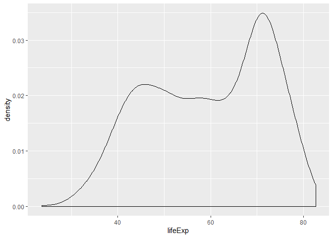
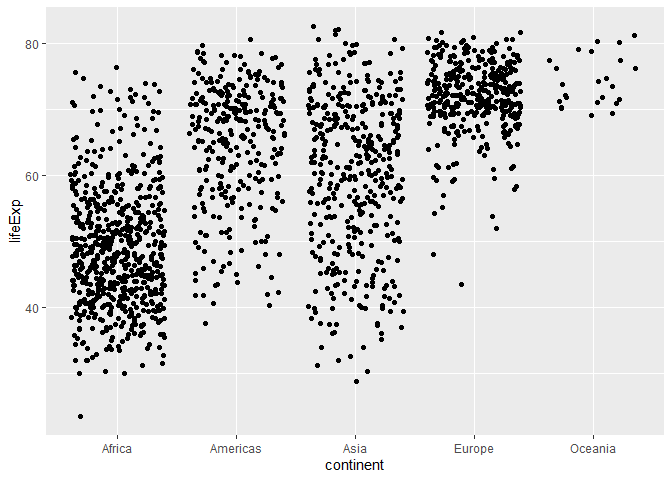

## Github pages

- From now on, any assignment that produces an html output needs to be hosted on Github pages as webpage. Including hw03. Notes on website for this. Went through it together for our own participation repo.
 - go in settings/options on github, enable github pages for master branch
 - in RStudio, create an html file in your repo if you don't already have one
  - go to any Rmd file and knit to html
 - commit your new html file to your repo so you can see it on github
 - open that html file on github, press copy path button. this gives you the path to your html file
 - that copied path, plus the main site that github pages gives you is the path to your html file
  - e.g. https://trevor-baker.github.io/STAT545-participation/Lectures/Lecture%2003%20-%20Sep%2010/rmd_exploration.html
  
  
## Plotting


### __histogram__

```r
ggplot(gapminder, aes(lifeExp)) +
  geom_histogram(bins = 50)
```

<!-- -->


### __density__
 - like a histogram but smoothed and sums to 1

```r
ggplot(gapminder, aes(lifeExp)) +
  geom_density()
```

<!-- -->
 
### __jitter__
 - plotspoints without overlap
 - ggplot is smart to not add vertical jitter to graph below as vertical jitter would change the data, just moves them horizontally
 

```r
ggplot(gapminder, aes(continent, lifeExp)) +
  geom_jitter()
```

<!-- -->
 
### __boxplot__
  - similar to jitter, but doens't show individual points
  - he prefers jitter to boxplot as it shows all the points
    - get a sense of how many points, can colour the points by some other variable


```r
ggplot(gapminder, aes(continent, lifeExp)) +
  geom_boxplot()
```

<!-- -->
    
### __ridge__
 - aka joy plot
 - a nicer way to show densities that compare different groups
 - don't have y axis to say how many points, so this is a relative comparison, not absolute numbers
 - geom_rug() adds something to plots, mark where there is observation, too fast for me to catch
 

```r
ggplot(gapminder, aes(lifeExp, continent)) +
  ggridges::geom_density_ridges() +
  geom_rug()
```

```
## Picking joint bandwidth of 2.23
```

<!-- -->

### violin
 - like a ridge plot but can't get as many groups onto the graph
 - switches them vertical and mirrors them, no overlap, side by side
 

```r
#this didn't work for me...
ggplot(gapminder, aes(lifeExp, continent)) +
  geom_violin()
```

```
## Warning: position_dodge requires non-overlapping x intervals
```

<!-- -->

### geom_bar vs geom_col
 - bar calculate heights by count of variables
 - col requires you to specify the height

```r
ggplot(mtcars, aes(cyl)) +
  geom_bar()
```

<!-- -->

```r
# ggplot(mtcars, aes(x=cyl)) +
#   geom_col() #won't work without y= , would need to do a count of cyl rows with dplyr and piping to provide the data for this function to work
```


### line
  - most useful if x axis is time series


```r
tsibble::as_tsibble(co2) %>% 
  rename(yearmonth = index,
         conc = value) %>% 
  mutate(month = lubridate::month(yearmonth, label = TRUE),
         year  = lubridate::year(yearmonth)) %>% 
  ggplot(aes(month, conc)) +
  geom_line(aes(group = year, colour=year), alpha = 0.8) +
  scale_colour_gradient(low="yellow", high="red") +
  ylab("CO2 Concentration")
```

<!-- -->


### path
 - similar to line except it connects points with a line in order they appear in dataset
 

```r
#I don't see the difference...
tsibble::as_tsibble(co2) %>% 
  rename(yearmonth = index,
         conc = value) %>% 
  mutate(month = lubridate::month(yearmonth, label = TRUE),
         year  = lubridate::year(yearmonth)) %>% 
  ggplot(aes(month, conc)) +
  geom_path(aes(group = year, colour=year), alpha = 0.8) +
  scale_colour_gradient(low="yellow", high="red") +
  ylab("CO2 Concentration")
```

<!-- -->

    
