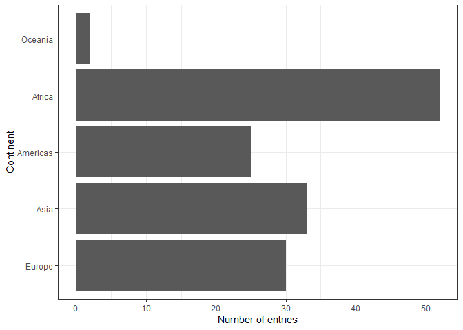

## Motivating the need for factors in R

### Activity 1: Using Factors for plotting 

**1.1** Let's look again into `gapminder` dataset and create a new cloumn, `life_level`, that contains five categories ("very high", "high","moderate", "low" and "very low") based on life expectancy in 1997. Assign categories accoring to the table below:

| Criteria          | life_level| 
|-------------      |-----------|
| less than 23      | very low |
| between 23 and 48 | low |
| between 48 and 59 | moderate |
| between 59 and 70 | high |
| more than 70      | very high |

Function `case_when()` is a tidier way to vectorise multiple `if_else()` statements. you can read more about this function [here](https://dplyr.tidyverse.org/reference/case_when.html).


```r
gapminder %>% 
  filter(year == 1997) %>% 
  mutate(life_level = case_when(lifeExp < 23 ~ "very low",
                                lifeExp < 48 ~ "low",
                                lifeExp < 59 ~ "moderate",
                                lifeExp < 70 ~ "high",
                                TRUE ~ "very high")) %>%
  ggplot() + geom_boxplot(aes(x = life_level, y = gdpPercap)) +
  labs(y = "GDP per capita, $", x= "Life expectancy level, years") +
  theme_bw() 
```

<!-- -->

Do you notice anything odd/wrong about the graph?

We can make a few observations:

- It seems that none of the countries had a "very low" life-expectancy in 1997. 

- However, since it was an option in our analysis it should be included in our plot. Right?

- Notice also how levels on x-axis are placed in the "wrong" order.

**1.2** You can correct these issues by explicitly setting the levels parameter in the call to `factor()`. Use, `drop = FALSE` to tell the plot not to drop unused levels 

```r
gm <- gapminder %>%  
        mutate(life_level = factor(case_when(lifeExp < 23 ~ "very low", #you provide a logical evaluation and the if(TRUE) result given behind the ~
                                      lifeExp < 48 ~ "low", #so its syntax is [logical] ~ ifTRUE, ifFALSE
                                      lifeExp < 59 ~ "moderate",
                                      lifeExp < 70 ~ "high",
                                      TRUE ~ "very high") , #in this row, we don't evaluate anything, its just the last ELSE just directly give TRUE
                            levels = c("very low","low","moderate","high","very high")))

gm %>% ggplot(aes(x = life_level, y = gdpPercap)) + 
        geom_boxplot() +
        labs(y = "GDP per capita, $", x= "Life expectancy level, years") +
        scale_x_discrete(drop=F) +
        theme_bw() 
```

<!-- -->

## Inspecting factors (activity 2)

In Activity 1, we created our own factors, so now let's explore what categorical variables that we have in the `gapminder` dataset.

### Exploring `gapminder$continent` (activity 2.1)

Use functions such as `str()`, `levels()`, `nlevels()` and `class()` to answer the following questions:

- what class is  `continent`(a factor or charecter)?
- How many levels? What are they?
- What integer is used to represent factor "Asia"?


```r
gapminder$continent %>%
  str()
```

```
##  Factor w/ 5 levels "Africa","Americas",..: 3 3 3 3 3 3 3 3 3 3 ...
```

```r
gapminder$continent %>%
  levels()
```

```
## [1] "Africa"   "Americas" "Asia"     "Europe"   "Oceania"
```

```r
gapminder$continent %>%
  nlevels()
```

```
## [1] 5
```

```r
gapminder$continent %>%
  class()
```

```
## [1] "factor"
```

### Exploring `gapminder$country` (activity 2.2)

Let's explore what else we can do with factors:

Answer the following questions: 

- How many levels are there in `country`?
- Filter `gapminder` dataset by 5 countries of your choice. How many levels are in your filtered dataset?


```r
gapminder$country %>% nlevels() #142 levels
```

```
## [1] 142
```

```r
gm2 <- gapminder %>%
        filter(country %in% c("Canada", "Mexico","Japan","China","Thailand"))
gm2$country %>% nlevels() #still 142 levels
```

```
## [1] 142
```

## Dropping unused levels

What if we want to get rid of some levels that are "unused" - how do we do that? 

The function `droplevels()` operates on all the factors in a data frame or on a single factor. The function `forcats::fct_drop()` operates on a factor.


```r
gm_drop_1 <- gm2 %>% 
  droplevels()

gm_drop_2 <- gm2 %>% mutate(country=forcats::fct_drop(gm$country))
```

```
## Error: Column `country` must be length 60 (the number of rows) or one, not 1704
```

```r
gm_drop_1$country %>% nlevels()
```

```
## [1] 5
```

```r
gm_drop_1$continent %>% nlevels() #in the first way the extra factors were dropped from continent as well
```

```
## [1] 2
```

```r
gm_drop_2$country %>% nlevels()
```

```
## Error in eval(lhs, parent, parent): object 'gm_drop_2' not found
```

```r
gm_drop_2$continent %>% nlevels() #the second way acts on country only and keep sall continent levels
```

```
## Error in eval(lhs, parent, parent): object 'gm_drop_2' not found
```

## Changing the order of levels

Let's say we wanted to re-order the levels of a factor using a new metric - say, count().

We should first produce a frequency table as a tibble using `dplyr::count()`:


```r
gapminder %>%
  filter(year==1997) %>%
  count(continent)
```

```
## # A tibble: 5 x 2
##   continent     n
##   <fct>     <int>
## 1 Africa       52
## 2 Americas     25
## 3 Asia         33
## 4 Europe       30
## 5 Oceania       2
```

The table is nice, but it would be better to visualize the data.
Factors are most useful/helpful when plotting data.
So let's first plot this:


```r
gapminder %>%
  filter(year==1997) %>%
  ggplot() +
  geom_bar(aes(x=continent)) +
  coord_flip() +
  theme_bw() +
  labs(y="Number of entries", x="Continent")
```

<!-- -->

Think about how levels are normally ordered. 
It turns out that by default, R always sorts levels in alphabetical order. 
However, it is preferable to order the levels according to some principle:

  1. Frequency/count. 
  
- Make the most common level the first and so on. Function `fct_infreq()` might be useful.
- The function `fct_rev()` will sort them in the opposite order.

For instance ,
    `  

```r
#in order of factor frequency
gapminder %>%
  filter(year==1997) %>%
  ggplot() +
  geom_bar(aes(x=fct_infreq(continent))) +
  coord_flip() +
  theme_bw() +
  labs(y="Number of entries", x="Continent")
```

<!-- -->

```r
#reverse order
gapminder %>%
  filter(year==1997) %>%
  ggplot() +
  geom_bar(aes(x=fct_rev(fct_infreq(continent)))) + #use nested
  coord_flip() +
  theme_bw() +
  labs(y="Number of entries", x="Continent")
```

<!-- -->

```r
gapminder %>%
  filter(year==1997) %>%
  ggplot() +
  geom_bar(aes(x=continent %>% fct_infreq() %>% fct_rev())) + #use all pipe
  coord_flip() +
  theme_bw() +
  labs(y="Number of entries", x="Continent")
```

<!-- -->

Section 9.6 of Jenny Bryan's [notes](https://stat545.com/factors-boss.html#reorder-factors) has some helpful examples.

  2. Another variable. 
  
  - For example, if we wanted to bring back our example of ordering `gapminder` countries by life expectancy, we can visualize the results using `fct_reorder()`. 


```r
gapminder %>%
  filter(year==1997) %>%
  ggplot() +
  geom_bar(aes(x=fct_reorder(continent, lifeExp))) + #by default it calculates it by median
  coord_flip() +
  theme_bw() +
  labs(y="Number of entries", x="Continent") 
```

<!-- -->

```r
gapminder %>%
  filter(year==1997) %>%
  ggplot() +
  geom_bar(aes(x=fct_reorder(continent, lifeExp, max))) + #can use third argument to give different summary stat to order by
  coord_flip() +
  theme_bw() +
  labs(y="Number of entries", x="Continent") 
```

<!-- -->

```r
gapminder %>%
  filter(year==1997) %>%
  ggplot() +
  geom_bar(aes(x=continent %>% fct_reorder(lifeExp, max))) + #same as above in pipe form
  coord_flip() +
  theme_bw() +
  labs(y="Number of entries", x="Continent") 
```

<!-- -->

Use `fct_reorder2()` when you have a line chart of a quantitative x against another quantitative y and your factor provides the color. 


```r
## order by life expectancy 
ggplot(gm2, aes(x = year, y = lifeExp,
                  color = fct_reorder2(country,lifeExp,year))) +
  geom_line() +
  labs(color = "country")
```

<!-- -->

## Change order of the levels manually

This might be useful if you are preparing a report for say, the state of affairs in Oceania.


```r
gapminder %>%
  filter(year==1997) %>%
  ggplot() +
  geom_bar(aes(x=continent %>% fct_relevel( c("Oceania", "Europe") ))) + #put Oceania first, don't need to specify others, they are filled by default
  coord_flip() +
  theme_bw() +
  labs(y="Number of entries", x="Continent") 
```

<!-- -->

```r
gapminder %>%
  filter(year==1997) %>%
  ggplot() +
  geom_bar(aes(x=continent %>% 
                 fct_relevel("Oceania") %>% #this would put Oceania first
                 fct_rev() )) + #use the fct_rev to put Oceania to the last instead
  coord_flip() +
  theme_bw() +
  labs(y="Number of entries", x="Continent") 
```

<!-- -->
More details on reordering factor levels by hand can be found [here] https://forcats.tidyverse.org/reference/fct_relevel.html

### Recoding factors

Sometimes you want to specify what the levels of a factor should be.
For instance, if you had levels called "blk" and "brwn", you would rather they be called "Black" and "Brown" - this is called recoding.
Lets recode `Oceania` and the `Americas` in the graph above as abbreviations `OCN` and `AME` respectively using the function `fct_recode()`.


```r
gapminder %>%
  filter(year==1997) %>%
  ggplot() +
  geom_bar(aes(x=continent %>% 
                 fct_recode("OCN"="Oceania") )) + #use syntax "new"="old"
  coord_flip() +
  theme_bw() +
  labs(y="Number of entries", x="Continent") 
```

<!-- -->

## Grow a factor (OPTIONAL)

Let’s create two data frames,`df1` and `df2` each with data from two countries, dropping unused factor levels.

```r
df1 <- gapminder %>%
        filter(country %in% c("Canada","Japan")) %>%
        droplevels()

df2 <- gapminder %>%
        filter(country %in% c("Norway","Sweden")) %>%
        droplevels()
```

The country factors in df1 and df2 have different levels.
Can we just combine them?

```r
df3 <- rbind.data.frame(df1,df2)

levels(df3$country) #seems that I can just combine them with rbind.data.frame
```

```
## [1] "Canada" "Japan"  "Norway" "Sweden"
```

```r
df4 <- full_join(df1,df2)
levels(df4$country)  #if using full_join, then factor column becomes character so would need to do this:
```

```
## NULL
```

```r
df5 <- full_join(df1,df2) %>% mutate(country=as.factor(country))
levels(df5$country)
```

```
## [1] "Canada" "Japan"  "Norway" "Sweden"
```

The country factors in `df1` and `df2` have different levels.
Can you just combine them using `c()`?

```r
c(df1$country, df2$country) #cannot do this, it gives integers and level 1 has one value in df1 and another in df2
```

```
##  [1] 1 1 1 1 1 1 1 1 1 1 1 1 2 2 2 2 2 2 2 2 2 2 2 2 1 1 1 1 1 1 1 1 1 1 1
## [36] 1 2 2 2 2 2 2 2 2 2 2 2 2
```

Explore how different forms of row binding work behave here, in terms of the country variable in the result.

```r
df6 <- bind_rows(df1,df2)
df6$country %>% levels()
```

```
## NULL
```
